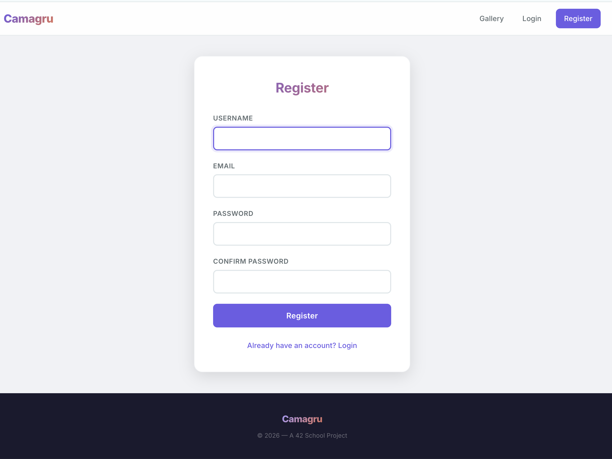
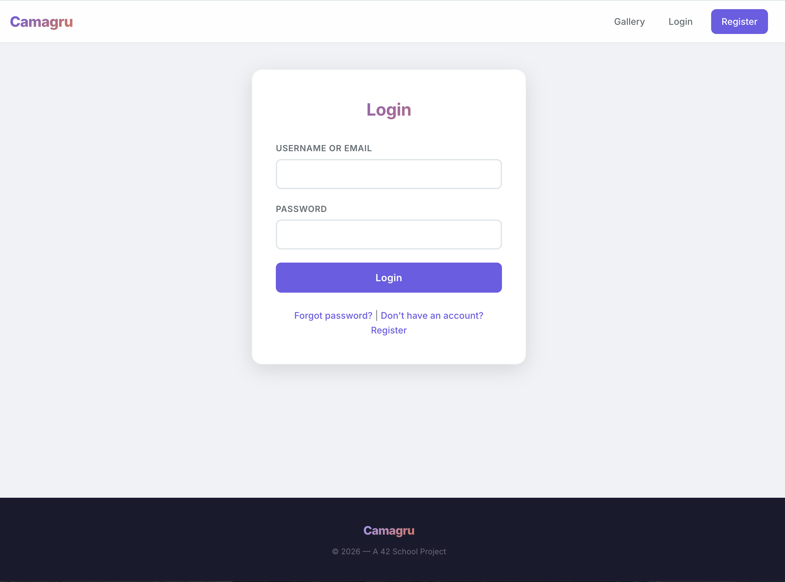
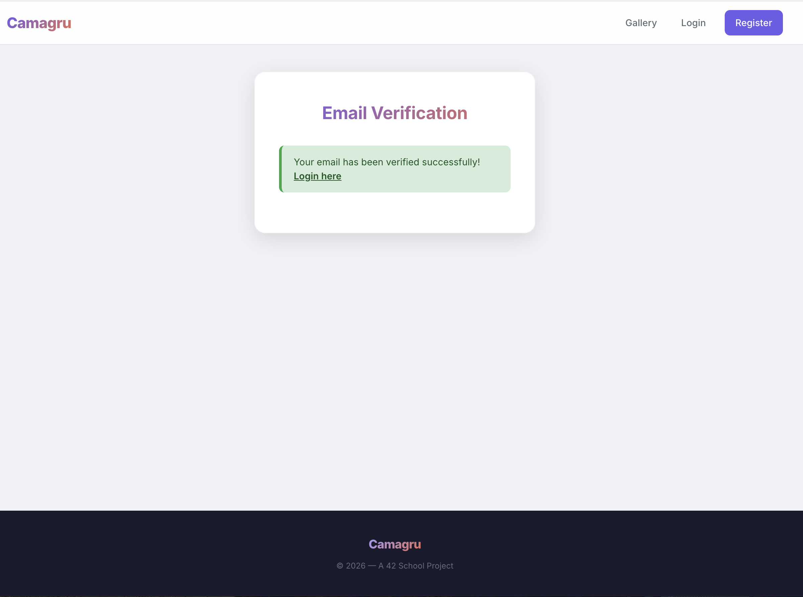
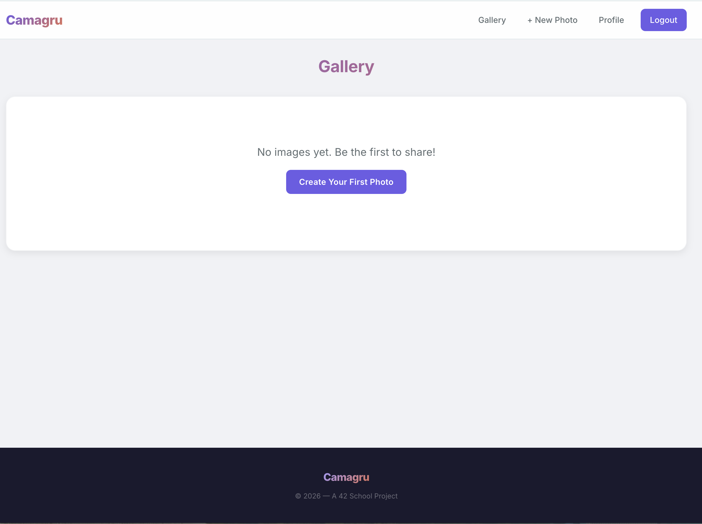
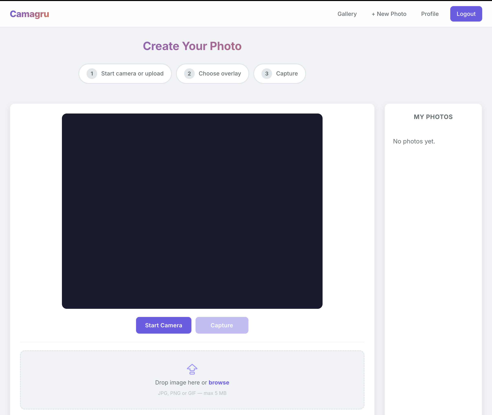
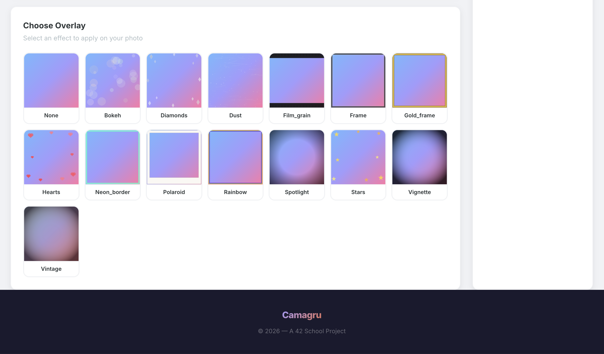
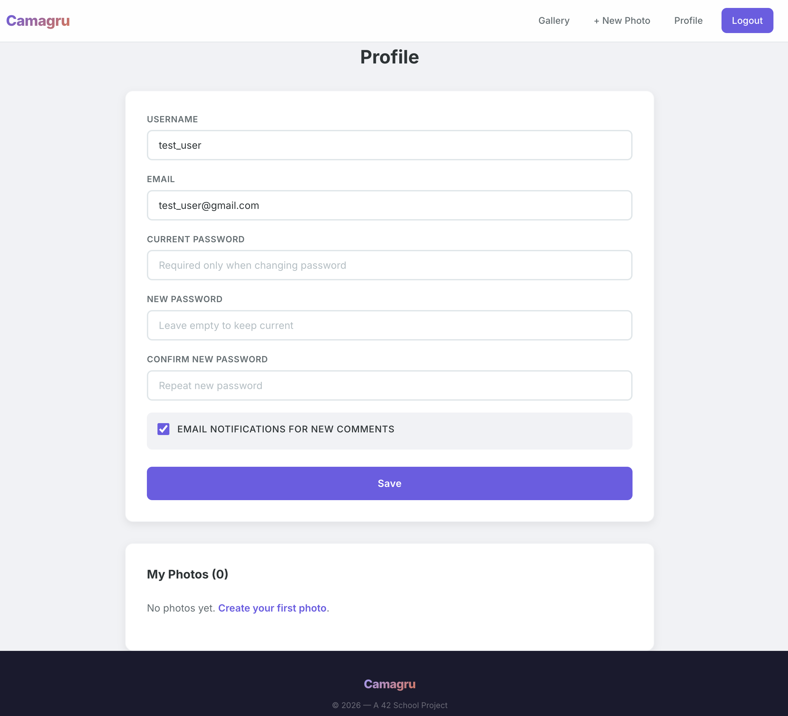
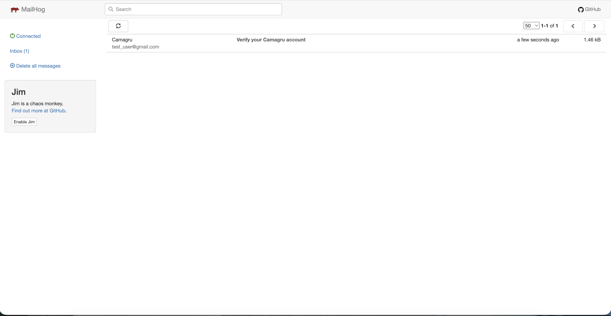

# Camagru

Web app for creating photos with a webcam or uploaded image, applying PNG overlays, and sharing results in a public gallery.

## Screenshots

This section shows the main user flows of the app from onboarding to creating images.

### 1) Registration → Email verification → Login

**Goal:** Create an account, verify it via email, then login and access authenticated routes.

1) **Registration page** — create a new account with username, email and password.



2) **Login page** — login is allowed only after email verification.



3) **Verification email in MailHog** — in development, all outgoing emails are captured by MailHog.
   Open MailHog at `http://localhost:8025`, open the verification email, and follow the verification link.


4) **Redirect after verification** — after clicking the verification link, the account becomes verified and the app redirects you back.



5) **After login** — once authenticated, navigation changes and protected pages (like `/edit` and `/profile`) become available.



### 2) Create a photo (webcam or upload) + apply PNG overlays

**Goal:** Capture from webcam or upload an image, pick one (or multiple) overlay(s), and save the resulting image.

1) **Edit page — camera/upload step** — start the camera (or upload a file) and prepare the source image.



2) **Edit page — overlay selection & live preview** — select an overlay; the preview canvas updates live.
   The final compositing is performed server-side when you click “Capture” / “Use This Image”.



### 3) Profile & notifications

**Goal:** Manage account details and comment notification preferences.

1) **Profile page** — view account information and toggle email notifications for new comments.



2) **MailHog inbox** — comment notifications, password resets, and verification emails are visible here in development.



## Quick Start

Create `.env` in the project root (see Installation for variables), then:

```bash
docker-compose up -d
```

Open http://localhost:8080. For development emails: http://localhost:8025 (MailHog).

## Features

**Account**
- Registration with email verification
- Login / logout
- Password recovery via email
- Profile: view account, toggle email notifications for comments
- Auth forms work via AJAX (no full page reload)

**Photos**
- Webcam capture or image upload
- Overlay effects (PNG with alpha) with live preview
- Single photo save or animated GIF (2–30 frames, server-side with Imagick)
- Own photos deletable by owner only

**Gallery**
- Public gallery with infinite scroll (load more on scroll)
- Like and comment (AJAX)
- Share on Facebook and Twitter (Open Graph / Twitter Card on `/image/{id}`)
- Responsive layout and mobile hamburger menu

**Security**
- CSRF tokens on forms and AJAX
- Prepared statements (SQL injection protection)
- Output escaping (XSS protection)
- Bcrypt passwords, file upload validation

## Installation

1. **Clone and enter project**
   ```bash
   git clone https://github.com/sergiishevchenko/camagru.git
   cd camagru
   ```

2. **Environment**
   Create `.env` in the project root, e.g.:
   ```env
   DB_HOST=db
   DB_NAME=camagru_db
   DB_USER=camagru_user
   DB_PASS=camagru_pass

   APP_URL=http://localhost:8080
   APP_ENV=development

   SECRET_KEY=your-secret-key-change-in-production
   SESSION_LIFETIME=3600

   SMTP_HOST=mailhog
   SMTP_PORT=1025
   SMTP_USER=
   SMTP_PASS=
   SMTP_FROM_EMAIL=noreply@camagru.local
   SMTP_FROM_NAME=Camagru

   UPLOAD_DIR=public/uploads
   MAX_FILE_SIZE=5242880
   ALLOWED_IMAGE_TYPES=jpg,jpeg,png,gif
   ```

3. **Overlays (optional)**
   Put PNG files with alpha in `frontend/images/overlays/` (e.g. `frame1.png`). They appear in the edit page.

4. **Run**
   ```bash
   docker-compose up -d
   ```
   App: http://localhost:8080 — MailHog: http://localhost:8025

## Usage

**Registration** → `/register` → confirm via email link (check MailHog in dev).

**Creating a photo** → Login → `/edit` → choose overlay → Start camera or upload image → Capture (or “Use This Image” for upload). Photo is saved and you are redirected to the gallery.

**Animated GIF** → On `/edit`: select overlay, start camera or use uploaded image → “Add frame” several times (2–30) → “Create GIF”. Requires Imagick in the container.

**Gallery** → Main page: scroll to load more. Like, comment, delete own photos. Use share buttons (f / 𝕏) to share the image page link (Facebook/Twitter use Open Graph).

**Profile** → `/profile` (when logged in): view info, toggle email notifications for new comments.

## Project Structure

```
camagru/
├── backend/
│   ├── src/
│   │   ├── config/          bootstrap, database, env, router
│   │   ├── controllers/     Auth, Image, Gallery, Like, Comment, Profile
│   │   ├── models/          User, Image, Like, Comment
│   │   ├── views/           layout, index, login, register, edit, profile, image, ...
│   │   ├── middleware/      AuthMiddleware
│   │   └── utils/           functions, email, image_processor
│   ├── public/              index.php (entry), .htaccess, uploads/
│   ├── Dockerfile
│   └── apache-config.conf
├── frontend/
│   ├── css/style.css
│   ├── js/                  edit.js, gallery.js, auth.js
│   └── images/overlays/     PNG overlays
├── database/schema.sql
├── docker-compose.yml
└── README.md
```

## API Overview

| Method | Path | Description |
|--------|------|-------------|
| GET | `/` | Gallery (HTML or `?page=n&format=json` for infinite scroll) |
| GET | `/image/{id}` | Single image page (sharing, Open Graph) |
| GET | `/login`, `/register`, `/forgot-password`, `/reset-password/{token}` | Auth pages |
| POST | `/login`, `/register`, `/forgot-password`, `/reset-password` | Auth (form or JSON) |
| GET | `/verify/{token}` | Email verification |
| GET | `/logout` | Logout |
| GET/POST | `/profile` | Profile (auth) |
| GET | `/edit` | Edit page (auth) |
| POST | `/edit/capture` | Save capture (auth) |
| POST | `/edit/upload` | Upload image (auth) |
| POST | `/edit/gif` | Create GIF from frames (auth) |
| DELETE | `/image/{id}` | Delete own image (auth) |
| POST | `/like/{imageId}` | Toggle like (auth) |
| GET/POST | `/comment/{imageId}` | Get / add comment |

## Database

Created automatically on first run. Schema: `database/schema.sql`.

- **users** — accounts, email verification, reset tokens, email_notifications
- **images** — user_id, filename, overlay_id, created_at
- **likes** — user_id, image_id (unique per user/image)
- **comments** — user_id, image_id, content, created_at

Default DB (from `.env`): host `db`, database `camagru_db`, user `camagru_user`.

## Email / SMTP Configuration

The app sends emails for account verification, password reset, and comment notifications.

| Variable | Description | Where to get |
|---|---|---|
| `SMTP_HOST` | SMTP server address | Your email provider's SMTP settings page |
| `SMTP_PORT` | SMTP port | `587` (TLS) or `465` (SSL) for most providers, `1025` for MailHog |
| `SMTP_USER` | SMTP login (usually your email) | Your email account |
| `SMTP_PASS` | SMTP password or app password | Provider's security settings (see below) |
| `SMTP_FROM_EMAIL` | "From" address shown to recipients | Any valid email you own |
| `SMTP_FROM_NAME` | "From" display name | Any name (e.g. "Camagru") |

**Common providers:**

| Provider | SMTP_HOST | SMTP_PORT | SMTP_PASS |
|---|---|---|---|
| Gmail | `smtp.gmail.com` | `587` | App Password (Google Account → Security → 2FA → App passwords) |
| Outlook / Hotmail | `smtp-mail.outlook.com` | `587` | Account password or app password |
| Yahoo | `smtp.mail.yahoo.com` | `587` | App Password (Yahoo Account → Security → App passwords) |
| Mailtrap (testing) | `sandbox.smtp.mailtrap.io` | `2525` | From Mailtrap inbox settings |
| MailHog (local dev) | `mailhog` | `1025` | Leave empty |

> **Gmail / Yahoo:** You must enable 2-Factor Authentication first, then generate an App Password. Regular account password will not work.

### Development (default)

MailHog is included in `docker-compose.yml` — catches all emails locally, nothing is actually sent:

```env
SMTP_HOST=mailhog
SMTP_PORT=1025
SMTP_USER=
SMTP_PASS=
SMTP_FROM_EMAIL=noreply@camagru.local
SMTP_FROM_NAME=Camagru
```

Captured emails: http://localhost:8025

### Production example (Gmail)

```env
SMTP_HOST=smtp.gmail.com
SMTP_PORT=587
SMTP_USER=your.email@gmail.com
SMTP_PASS=abcd-efgh-ijkl-mnop
SMTP_FROM_EMAIL=your.email@gmail.com
SMTP_FROM_NAME=Camagru
```

> `SMTP_PASS` here is an **App Password**, not your Google account password. Generate it at: Google Account → Security → 2-Step Verification → App passwords.

## Security

- Prepared statements for all DB queries
- `htmlspecialchars` for output
- CSRF token on forms and AJAX
- Bcrypt passwords; file upload checks (type, size, rename)
- Auth middleware on protected routes; users can delete only their images

## Commands

```bash
docker-compose up -d          # start
docker-compose down           # stop
docker-compose down -v        # stop and remove volumes (DB data)
docker-compose logs -f        # logs
docker-compose restart web    # after code changes
```

## Browser Support

Chrome 46+, Firefox 41+, Safari, Edge. Webcam needs HTTPS in production or localhost.
